# Auditoria grafica, de frontend y experiencia de uso

- Fecha de auditoria: 13 de julio de 2026
- Commit auditado: `ab2a07b` (`Implement first audit safety batch`)
- Rama: `main`
- Estado inicial: repositorio limpio y sincronizado con `origin/main`

## 1. Objeto de este documento

Este archivo convierte la auditoria visual de Lapeziness Doroptero 3 en propuestas independientes. Cada propuesta tiene un ID, prioridad, alcance, evidencia, instrucciones exactas, criterios de aceptacion y pruebas. El propietario puede aprobar, rechazar, modificar o posponer cada punto sin aceptar el resto.

Este commit no debe cambiar la interfaz ni la logica de produccion. Solo incorpora este documento y las capturas de evidencia de `docs/auditoria-grafica/`.

### Como responder

```text
APROBAR: G-NAV-01, G-NAV-02, G-CRO-03
RECHAZAR: G-HOY-01
POSPONER: G-CAL-01
MODIFICAR G-SOL-01: conservar el boton Guardar y ocultar solo los detalles avanzados
```

Una IA que reciba una aprobacion debe:

1. Implementar solo los IDs aprobados y las dependencias expresamente aceptadas.
2. No mezclar una limpieza general no aprobada con un cambio visual concreto.
3. Conservar datos, cronometro, solidez, historial, importacion y sincronizacion salvo que el ID diga lo contrario.
4. Ejecutar los criterios y pruebas indicados en cada propuesta.
5. Actualizar el estado de los IDs en este documento y, cuando exista solapamiento, tambien en `AUDITORIA_Y_HOJA_DE_RUTA.md`.
6. Hacer `fetch` antes de editar y comprobar que `main` no haya avanzado.
7. Hacer un commit coherente por lote aprobado y `push` directo a `origin/main`, segun la politica indicada por el propietario.
8. Si cambia un recurso servido, actualizar de forma coordinada la version de la app y la cache del service worker.

## 2. Alcance y metodo

Se ha revisado el frontend real, no solo el HTML estatico:

- Las cinco pestañas principales, Ajustes y los modales mas importantes.
- Cronometro en reposo, en marcha y en pausa.
- Estados vacios y estados con una obra, dos mediciones de solidez y un bloque de estudio.
- Movil vertical, iPad vertical, iPad horizontal y escritorio.
- Jerarquia, densidad, tipografia, color, contraste, movimiento, scroll y controles tactiles.
- Coherencia entre pestañas, redundancias, funciones visibles sin utilidad clara y codigo visual oculto que sigue ejecutandose.
- Graficas con cero, uno y dos datos, ademas de una semana con 45 minutos.
- Relacion entre lo mostrado y los datos que acaban de guardarse.

Resoluciones probadas:

| Dispositivo de referencia | Resolucion |
|---|---:|
| Movil | 390 x 844 |
| iPad vertical | 834 x 1194 |
| iPad horizontal | 1024 x 768 |
| Escritorio | 1280 x 720 |

Las capturas usan datos de prueba locales y no representan la cuenta real del propietario.

## 3. Diagnostico ejecutivo

La app contiene una buena base visual, especialmente el cronometro en marcha y el modal de registro de solidez. El problema principal no es la falta de estilo, sino la acumulacion: varias generaciones de temas, componentes y metaforas siguen conviviendo. Cada pestaña parece haber crecido con reglas propias y la arquitectura visual ya no ayuda a distinguir lo esencial de lo secundario.

Los problemas mas urgentes son:

1. **La navegacion movil se desborda.** A 390 px, la barra tiene 307 px visibles para 340 px de contenido, permite scroll horizontal y solapa o recorta etiquetas.
2. **El tamaño de texto escala toda la aplicacion con `zoom`.** `Grande`, que ademas es el valor predeterminado, multiplica geometria, barra inferior y espacios; `XL` llega a 1,5. Esto produce layouts distintos en vez de una accesibilidad tipografica fiable.
3. **El encabezado global ocupa demasiado y no orienta.** En movil, `Planificador de estudio` y la fecha llegan a tres lineas; se repite en todas las pestañas sin decir donde esta el usuario.
4. **Estadisticas mezcla demasiados productos.** Tiempo, racha, recomendaciones, mantenimiento, solidez, compases, estado diario e historial aparecen en una sola columna de mas de 2400 px.
5. **La interfaz puede quedar desactualizada tras guardar.** El registro manual refresca historial, racha y resumen, pero no `renderStatsDashboard()`. Durante la prueba se guardaron 45 minutos y Estadisticas siguio mostrando 0 hasta salir y volver.
6. **La pausa del cronometro pierde legibilidad.** El fondo queda casi blanco, aparecen dos relojes con jerarquia ambigua y el control de reanudar no domina visualmente.
7. **Obras muestra herramientas antes de que hagan falta.** En estado vacio aparecen buscador, selector, cuatro filtros, editar, ordenar, densidad y dos botones para añadir.
8. **Las graficas interpretan muestras insuficientes.** Un unico estudio genera un “pico” horario y un donut del 100%; dos pases el mismo dia producen una evolucion casi vacia con escala 1-10, mientras la tarjeta usa porcentaje.

### Complejidad visual medida

- `styles.css`: 10.835 lineas.
- Reglas `!important`: 370.
- Consultas `@media`: 43.
- Declaraciones `font-family`: 377.
- Declaraciones de animacion: 66.
- Declaraciones de transicion: 165.
- Bloques `@keyframes`: 49.
- Selectores de temas no activables que siguen presentes: `cozy` 43, `swiss` 34, `brutalista` 33, `botanico` 22, `concierto` 20, `bruma` 19 y `velvet` 10.

Estas cifras no son un problema por si solas, pero explican por que un ajuste local suele necesitar otra capa de excepciones.

## 4. Evidencia visual

### Movil: encabezado y barra inferior

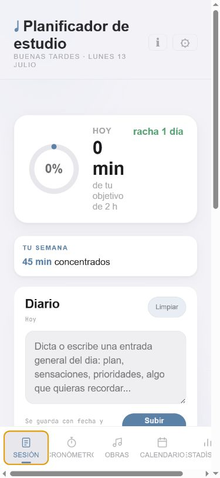

### iPad horizontal: buena base del cronometro en marcha

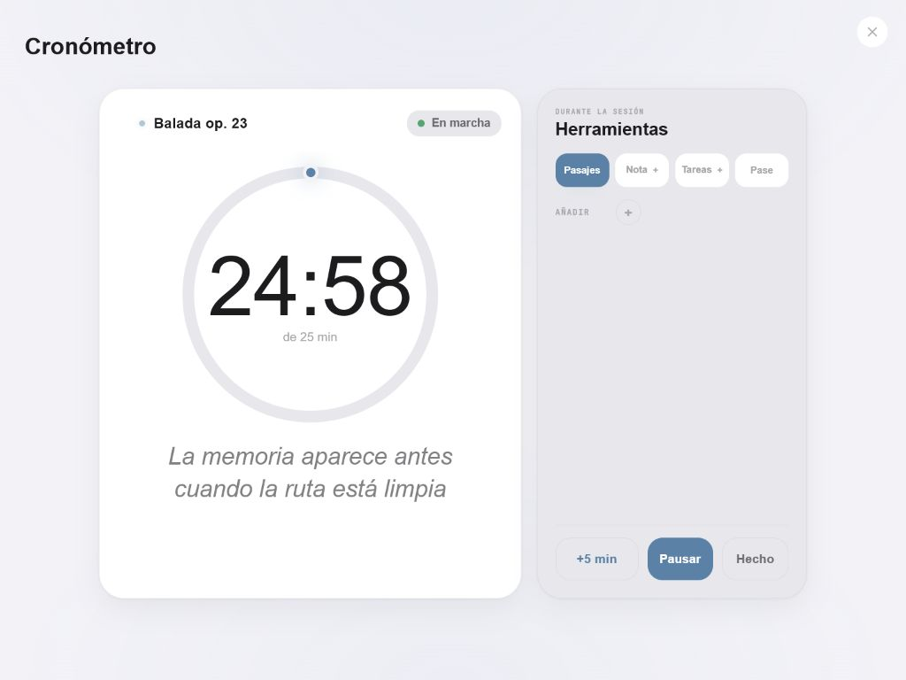

Esta composicion debe conservarse como referencia: reloj dominante, estado claro, obra visible y controles centrados.

### iPad horizontal: Hoy sigue siendo una columna larga

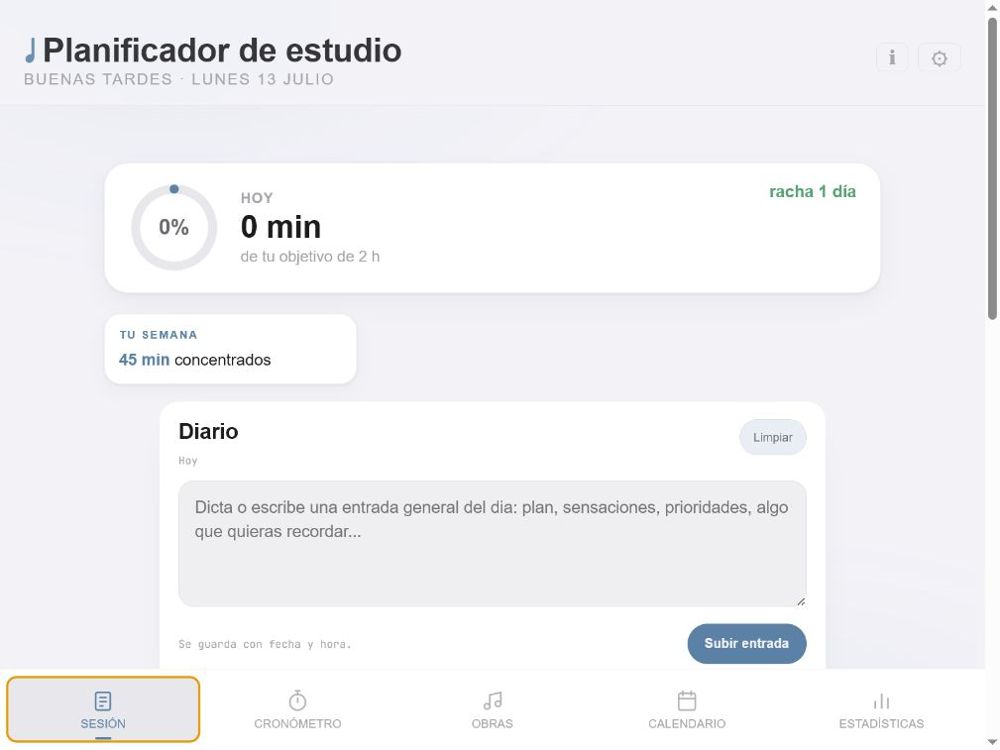

### iPad horizontal: pausa lavada y ambigua

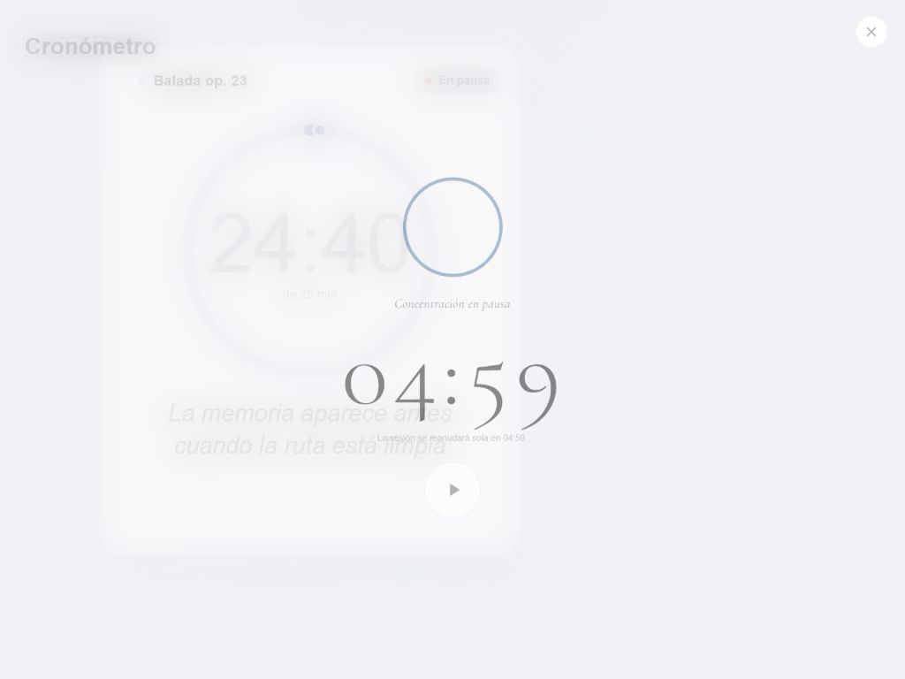

### Obras vacias: controles antes que contenido

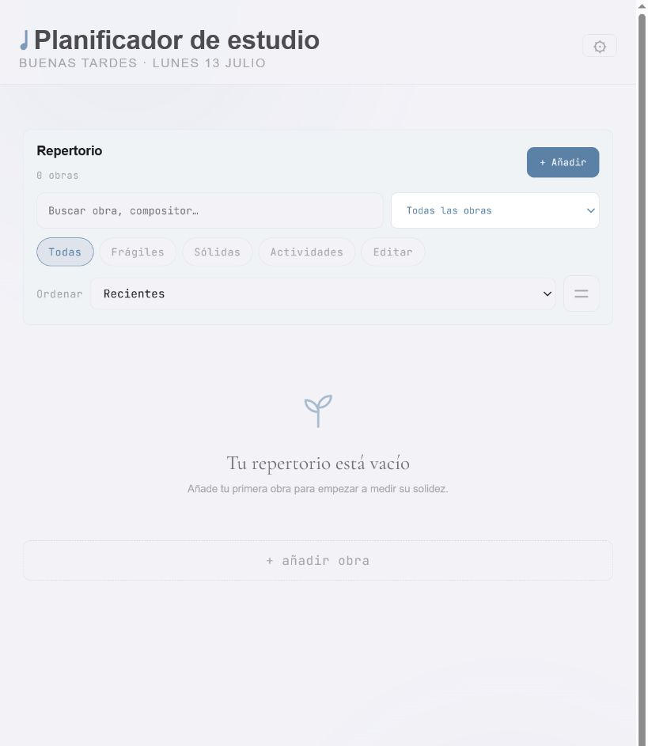

### Evolucion con dos mediciones

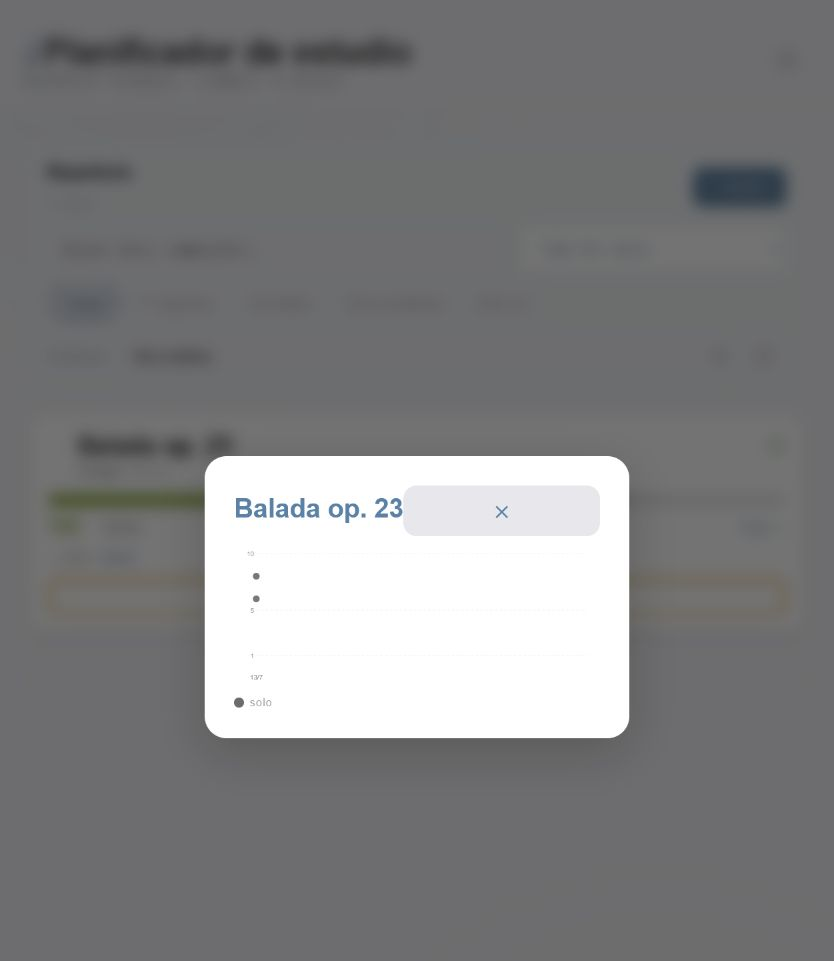

### Calendario: mes sin detalle asociado

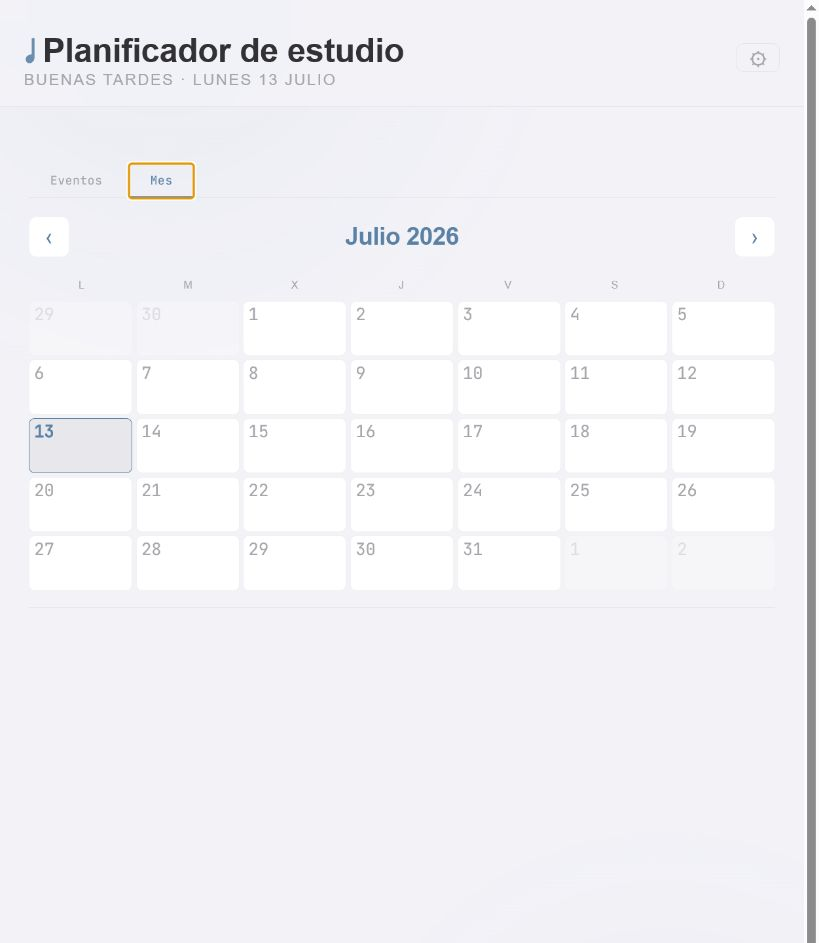

### Estadisticas vacias y escritorio

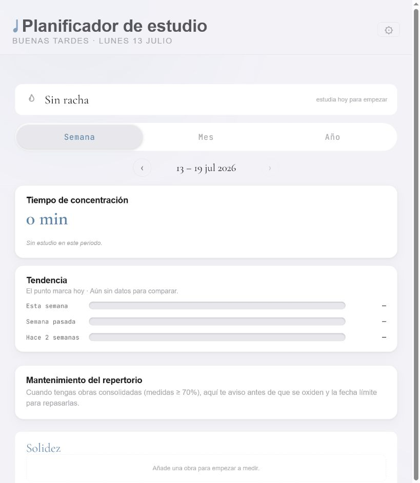

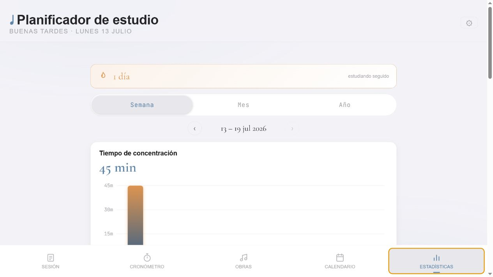

### Ajustes: una base visual que conviene simplificar, no reemplazar

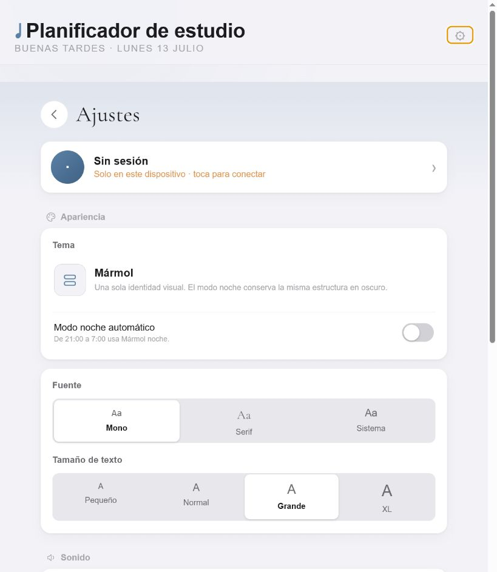

## 5. Lo que conviene preservar

No todo necesita rediseño. Estas piezas son una buena base:

- **Cronometro en marcha:** la escena principal y el anillo tienen presencia, se adaptan bien a iPad horizontal y se sienten mas cuidados que el resto de la app.
- **Modal “Como fue el pase”:** la pregunta es clara, las cinco respuestas son comprensibles y el flujo registra una observacion valiosa.
- **Ajustes:** tarjetas, iconos y separacion por grupos ya tienen una jerarquia bastante consistente; necesitan simplificacion, no una identidad nueva.
- **Feedback breve de guardado:** el check y los mensajes cortos funcionan cuando no compiten con otros indicadores.
- **Marmol:** es una direccion visual razonable. Conviene convertirla en un sistema unico y real, no volver a abrir siete temas.

## 6. Comparacion entre pestañas

| Vista actual | Identidad que transmite | Accion principal | Problema dominante | Direccion propuesta |
|---|---|---|---|---|
| Sesion | Diario de bienestar | Guardar entrada | El nombre sugiere estudio, pero el contenido principal es diario y estado fisico | Renombrar a Hoy y colocar el estudio antes que el diario |
| Cronometro | Herramienta de concentracion | Plantar/Iniciar | Buena escena, demasiadas microfunciones y pausa poco legible | Preservar la escena y reducir herramientas concurrentes |
| Obras | Gestor avanzado de repertorio | Añadir/Pase/Evolucion | Barra densa, filtros duplicados y acciones con igual peso | Tarjeta orientada a Registrar pase; herramientas progresivas |
| Calendario | Calendario y lista separados | Añadir evento | Mes no interactivo y demasiado espacio vacio | Mes seleccionable mas agenda del dia |
| Estadisticas | Varios paneles acumulados | Interpretar datos | Contenido largo, controles sin alcance comun y conclusiones con poca muestra | Separar Tiempo, Solidez, Estado e Historial |
| Ajustes | Preferencias del sistema | Cambiar configuracion | Opciones duplicadas o falsas y herramientas tecnicas en primer nivel | Preferencias esenciales y pantalla avanzada de datos |

## 7. Resumen de propuestas

| ID | Prioridad | Tamaño | Propuesta | Estado |
|---|---:|---:|---|---|
| G-SYS-01 | P1 | L | Consolidar Marmol y retirar capas de temas antiguos | PENDIENTE |
| G-SYS-02 | P1 | M | Definir roles tipograficos reales y quitar el selector falso | PENDIENTE |
| G-SYS-03 | P1 | L | Sustituir `zoom` por tamaño tipografico accesible | PENDIENTE |
| G-SYS-04 | P1 | M | Unificar contraste, foco y modo claro/automatico/oscuro | PENDIENTE |
| G-SYS-05 | P1 | L | Crear un sistema responsive para movil, iPad y escritorio | PENDIENTE |
| G-NAV-01 | P1 | M | Sustituir el encabezado global por una barra contextual compacta | PENDIENTE |
| G-NAV-02 | P1 | S | Corregir definitivamente la navegacion inferior movil | PENDIENTE |
| G-NAV-03 | P1 | M | Dar a todas las pestañas la misma estructura de titulo y acciones | PENDIENTE |
| G-FLU-01 | P1 | M | Reducir transiciones y completar movimiento reducido | PENDIENTE |
| G-FLU-02 | P2 | M | Unificar toasts, guardado y estado de sincronizacion | PENDIENTE |
| G-HOY-01 | P1 | M | Renombrar Sesion a Hoy y reordenar su proposito | PENDIENTE |
| G-HOY-02 | P1 | M | Hacer honestos los estados sin registrar y el objetivo diario | PENDIENTE |
| G-HOY-03 | P1 | L | Compactar el registro diario y usar dos columnas en iPad | PENDIENTE |
| G-CRO-01 | P1 | M | Simplificar el cronometro en reposo sin perder funciones | PENDIENTE |
| G-CRO-02 | P1 | M | Ordenar herramientas y acciones durante el estudio | PENDIENTE |
| G-CRO-03 | P1 | M | Rediseñar la pausa como un estado legible y accesible | PENDIENTE |
| G-REP-01 | P1 | M | Simplificar el vacio y la barra de herramientas de Obras | PENDIENTE |
| G-REP-02 | P1 | M | Rehacer la jerarquia de la tarjeta de obra | PENDIENTE |
| G-SOL-01 | P1 | M | Convertir Registrar pase en un flujo rapido y fiable | PENDIENTE |
| G-SOL-02 | P1 | L | Rediseñar Evolucion con escala y muestras honestas | PENDIENTE |
| G-CAL-01 | P2 | L | Integrar mes interactivo y agenda del dia | PENDIENTE |
| G-EST-01 | P1 | L | Separar Estadisticas por dominios con alcance claro | PENDIENTE |
| G-EST-02 | P1 | M | Eliminar recomendaciones y ocultar paneles sin datos | PENDIENTE |
| G-EST-03 | P1 | L | Mejorar las graficas de tiempo y comparacion | PENDIENTE |
| G-EST-04 | P1 | M | Aplicar umbrales a graficas de distribucion y patrones | PENDIENTE |
| G-EST-05 | P1 | S | Refrescar todas las vistas afectadas despues de guardar | PENDIENTE |
| G-AJU-01 | P1 | M | Simplificar Ajustes y aprovechar iPad horizontal | PENDIENTE |
| G-AJU-02 | P2 | M | Mover importacion y exportacion avanzada a otra pantalla | PENDIENTE |
| G-LIM-01 | P1 | L | Retirar componentes visuales ocultos que siguen ejecutandose | PENDIENTE |
| G-QA-01 | P1 | L | Añadir una matriz de regresion visual y usabilidad | PENDIENTE |

P1 indica friccion importante, incoherencia visible o fallo funcional reproducible. P2 indica simplificacion o acabado que puede esperar a que la estructura principal sea estable.

## 8. Propuestas detalladas

### G-SYS-01. Consolidar Marmol y retirar capas de temas antiguos

- **Estado:** PENDIENTE
- **Prioridad:** P1
- **Tamaño:** L
- **Tipo:** Sistema visual y mantenibilidad
- **Dependencias:** `QUA-01` implementado; coordinar con `ARC-02`.

**Evidencia**

`THEME_DAY` y `THEME_NIGHT` solo permiten `marmol` y `marmol-night`, pero `styles.css` conserva cientos de selectores para Cozy, Swiss, Brutalista, Botanico, Concierto, Bruma y Velvet. `loadTheme()` todavia ejecuta migraciones que pasan por Cozy y Concierto antes de volver a Marmol. El resultado son 370 `!important` y reglas tardias que cambian componentes ya definidos.

**Instruccion exacta**

1. Crear una captura base de cada vista en Marmol claro y oscuro antes de borrar CSS.
2. Definir tokens unicos para superficie, texto, borde, acento, exito, aviso, error, sombra, radio y espaciado.
3. Sustituir colores y radios especificos de componentes por esos tokens cuando el resultado sea equivalente.
4. Eliminar selectores de los temas no activables y sus migraciones una vez que las capturas de Marmol no cambien de forma no intencionada.
5. Mantener solo las diferencias necesarias entre `marmol` y `marmol-night`; ambos deben compartir geometria.
6. Evitar nuevas reglas `!important` salvo una razon documentada de accesibilidad o compatibilidad.

**Criterios de aceptacion**

- Ningun tema no activable aparece en HTML, JS o CSS de produccion.
- Claro y oscuro tienen la misma composicion y cambian solo tokens de apariencia.
- Las vistas principales no dependen del orden accidental de varias capas de overrides.
- Se reduce de forma material el numero de `!important` sin regresiones visuales.

**Pruebas minimas**

- Comparacion visual de todas las vistas a 390, 834, 1024 y 1280 px.
- Buscar `cozy`, `swiss`, `brutalista`, `botanico`, `concierto`, `bruma` y `velvet` al terminar.
- Comprobar modales, focus, estado activo, error y deshabilitado en claro y oscuro.

---

### G-SYS-02. Definir roles tipograficos reales y quitar el selector falso

- **Estado:** PENDIENTE
- **Prioridad:** P1
- **Tamaño:** M
- **Tipo:** Coherencia visual

**Evidencia**

Ajustes ofrece Mono, Serif y Sistema. Al elegir Serif, Marmol sigue forzando la fuente del encabezado, las tarjetas, las ayudas y la navegacion a sistema; solo cambian piezas aisladas. La app mezcla sistema, Cormorant y JetBrains Mono sin que cada familia tenga una funcion estable.

**Instruccion exacta**

1. Eliminar el selector de familia de Ajustes, salvo que se decida implementar tres variantes completas de toda la interfaz.
2. Usar la fuente del sistema para controles, navegacion, formularios y texto de lectura.
3. Reservar serif, si se conserva, para nombres de obras, citas o cifras protagonistas concretas.
4. Reservar monoespaciada para reloj, duraciones, porcentajes y metadatos tabulares.
5. Definir una escala de tipos con tokens: titulo de vista, titulo de seccion, cuerpo, etiqueta, dato grande y metadato.
6. Eliminar `font-family` repetidos cuando puedan heredar del rol correspondiente.

**Criterios de aceptacion**

- Cambiar una preferencia no puede producir una interfaz parcialmente cambiada.
- Cada familia tiene una funcion explicable y consistente entre pestañas.
- Nombres largos, cifras y etiquetas no se recortan en las resoluciones objetivo.

**Pruebas minimas**

- Obra y compositor largos, titulo de app largo y fechas localizadas.
- Capturas de las seis vistas con la misma jerarquia tipografica.
- Verificacion a 200% de zoom del navegador sin perdida de contenido.

---

### G-SYS-03. Sustituir `zoom` por tamaño tipografico accesible

- **Estado:** PENDIENTE
- **Prioridad:** P1
- **Tamaño:** L
- **Tipo:** Responsive y accesibilidad

**Evidencia**

`setFontSize()` aplica `0.82`, `1`, `1.22` o `1.5` mediante CSS `zoom` o `transform`. `Grande` es el valor predeterminado. Por tanto, el ajuste aumenta tambien navegacion, margenes, anchos, modales y hit areas; en XL el layout cambia y la barra inferior pasa a ocupar mas espacio. En iOS antiguo existe ademas un fallback que transforma todo el `body`.

**Instruccion exacta**

1. Eliminar `applyZoom()` y cualquier geometria que dependa de `_appZoom`.
2. Sustituir el ajuste por dos o tres niveles de tipografia que modifiquen tokens de fuente y altura de linea, no el lienzo completo.
3. Mantener tamaños tactiles de al menos 44 x 44 px independientemente del nivel de texto.
4. Permitir que tarjetas, barras y botones hagan reflow; no encoger texto para que quepa.
5. Usar `clamp()` solo para limites razonables, nunca para escalar toda la interfaz con el viewport.
6. Cambiar el valor predeterminado a Normal para instalaciones nuevas y respetar la preferencia previa mediante una migracion conservadora.

**Criterios de aceptacion**

- Aumentar texto no altera el ancho logico del viewport ni crea scroll horizontal.
- La barra inferior conserva la misma altura y cinco destinos utilizables.
- Ningun modal sale de pantalla y el contenido sigue siendo accesible con scroll interno.
- El ajuste se comporta igual en Safari de iPad y navegadores de escritorio.

**Pruebas minimas**

- Todos los niveles en 390 x 844 y 834 x 1194.
- Orientacion horizontal con teclado virtual y modal abierto.
- Zoom del navegador a 200% y tamaño de texto grande del sistema.

---

### G-SYS-04. Unificar contraste, foco y modo claro/automatico/oscuro

- **Estado:** PENDIENTE
- **Prioridad:** P1
- **Tamaño:** M
- **Tipo:** Accesibilidad y preferencias

**Evidencia**

Etiquetas, ejes, pestañas inactivas y metadatos usan grises muy tenues. El foco naranja aparece tambien despues de clics de puntero y parece un estado de alerta o seleccion distinto al acento azul. El modo oscuro solo puede activarse automaticamente entre 21:00 y 7:00; no se puede forzar ni previsualizar de dia.

**Instruccion exacta**

1. Sustituir el interruptor nocturno por un control segmentado `Claro / Automatico / Oscuro`.
2. Medir contraste de texto, iconos, bordes y estados contra WCAG AA; no usar opacidad extrema para contenido necesario.
3. Definir un unico token de foco compatible con el acento y aplicarlo con `:focus-visible`.
4. Evitar que un clic de puntero deje un contorno brillante persistente.
5. No comunicar solidez, error, seleccion o evento solo mediante color.
6. Probar ambos modos con los mismos datos y sin cambios de geometria.

**Criterios de aceptacion**

- Texto normal necesario alcanza 4,5:1 y texto grande 3:1.
- Todos los controles tienen foco visible por teclado, pero no una falsa seleccion tras tocar.
- El usuario puede fijar claro u oscuro en cualquier hora.

**Pruebas minimas**

- Navegacion completa solo con teclado.
- Claro, automatico y oscuro con hora simulada a las 06:59, 07:00, 20:59 y 21:00.
- Comprobacion con escala de grises y contraste aumentado.

---

### G-SYS-05. Crear un sistema responsive para movil, iPad y escritorio

- **Estado:** PENDIENTE
- **Prioridad:** P1
- **Tamaño:** L
- **Tipo:** Layout

**Evidencia**

La regla base de `.view` limita casi todo a 700 px. Con el zoom predeterminado, Estadisticas mide unos 854 px visuales en un escritorio de 1280 px y sigue siendo una columna de 2403 px de alto. Sesion en iPad horizontal tambien permanece en una columna larga. El cronometro ya usa una composicion especifica de dos zonas y demuestra que hay espacio util.

**Instruccion exacta**

1. Definir contenedores por tipo de vista, no un unico maximo global: lectura estrecha, formularios y panel de datos.
2. Mantener movil en una columna con orden de prioridad claro.
3. A partir de unos 768-900 px, permitir grids de dos columnas para resumenes independientes.
4. Hacer que la tarjeta principal o grafica principal pueda ocupar ambas columnas.
5. Evitar tarjetas anidadas y grandes paneles flotantes; usar secciones sin marco cuando no necesiten contener una unidad repetible.
6. Mantener una longitud de linea comoda en diario y textos aunque el panel general sea ancho.
7. Definir espaciados y gutters para movil, iPad vertical, iPad horizontal y escritorio.

**Criterios de aceptacion**

- iPad horizontal muestra al menos dos piezas secundarias en paralelo en Hoy, Estadisticas y Ajustes.
- No aparece scroll horizontal a ningun ancho entre 320 y 1366 px.
- Las tarjetas principales no quedan estiradas con grandes zonas vacias.
- El orden visual coincide con el orden de lectura y foco.

**Pruebas minimas**

- Barrido automatizado de anchos 320, 375, 390, 768, 834, 1024, 1180 y 1280.
- Texto largo, estados vacios y datos abundantes.
- Rotacion de iPad con la misma vista y modal abierto.

---

### G-NAV-01. Sustituir el encabezado global por una barra contextual compacta

- **Estado:** PENDIENTE
- **Prioridad:** P1
- **Tamaño:** M
- **Tipo:** Navegacion y jerarquia

**Evidencia**

`Planificador de estudio` se repite en cada pantalla, es editable al tocarlo y no identifica la pestaña actual. En movil se parte en dos lineas y la fecha ocupa otra. Consume alrededor de 130 px antes del contenido util.

**Instruccion exacta**

1. Mostrar como titulo principal el nombre de la vista: `Hoy`, `Cronometro`, `Obras`, `Calendario`, `Estadisticas` o `Ajustes`.
2. Usar una barra compacta con altura estable, safe area y acciones del contexto a la derecha.
3. Colocar la fecha solo en Hoy o Calendario, no en todas las vistas.
4. Mover el nombre del producto a Ajustes, splash, manifiesto o un subtitulo discreto.
5. Eliminar la edicion directa del titulo o trasladarla a una preferencia avanzada con longitud maxima.
6. Mantener el engranaje con area tactil de 44 px y etiqueta accesible.

**Criterios de aceptacion**

- El usuario sabe en que vista esta aunque no vea la barra inferior.
- El encabezado nunca ocupa mas de una linea en 320 px.
- Las acciones del encabezado no cambian de posicion al cargar datos.

**Pruebas minimas**

- Titulo de obra, app y fecha largos.
- Safe areas de iPad/iPhone y modo standalone PWA.
- Recorrido de las seis vistas con lector de pantalla.

---

### G-NAV-02. Corregir definitivamente la navegacion inferior movil

- **Estado:** PENDIENTE
- **Prioridad:** P1
- **Tamaño:** S
- **Tipo:** Bug responsive
- **Relacion:** Solapa con `NAV-02` de la auditoria integral; una implementacion debe cerrar ambos IDs.

**Evidencia**

A 390 px, la navegacion tiene 307 px de ancho util y 340 px de contenido. Usa `overflow-x: auto`; las cinco etiquetas no caben y aparecen recortes, solapes y una zona desplazable que no parece intencionada.

**Instruccion exacta**

1. Usar cinco columnas `minmax(0, 1fr)` sin scroll horizontal.
2. Reducir padding lateral interno, no el tamaño tactil vertical ni la legibilidad.
3. Permitir etiquetas de una linea con abreviaturas coherentes si 320 px lo requiere.
4. Eliminar reglas posteriores que vuelvan a imponer anchos o padding incompatibles.
5. Reservar el safe area inferior y evitar que el contenido quede oculto tras la barra.

**Criterios de aceptacion**

- `scrollWidth` es igual a `clientWidth` entre 320 y 430 px.
- Las cinco acciones son visibles, separadas y de al menos 44 px de alto.
- No hay scrollbar horizontal ni movimiento lateral al tocar.

**Pruebas minimas**

- 320, 360, 375, 390 y 430 px con Normal y texto grande.
- Claro y oscuro.
- Cambio rapido entre todas las pestañas.

---

### G-NAV-03. Dar a todas las pestañas la misma estructura de titulo y acciones

- **Estado:** PENDIENTE
- **Prioridad:** P1
- **Tamaño:** M
- **Tipo:** Coherencia transversal
- **Dependencia recomendada:** G-NAV-01.

**Evidencia**

Sesion no tiene titulo propio; Obras introduce `Repertorio` dentro de una barra; Calendario empieza con `Eventos / Mes`; Estadisticas empieza con la racha; Cronometro usa una escena completa. Las acciones para añadir aparecen arriba, abajo o solo dentro de un estado vacio segun la pestaña.

**Instruccion exacta**

1. Crear una plantilla comun de cabecera de vista: titulo, subtitulo opcional y una accion primaria opcional.
2. Usar `Añadir obra`, `Añadir evento` o `Registrar estudio` siempre en la misma zona cuando corresponda.
3. Tratar segmentos como filtros debajo del titulo, no como sustitutos del titulo.
4. Mantener el cronometro como excepcion de escena completa, pero con el mismo contrato de navegacion y ajustes.
5. Eliminar botones primarios duplicados al final de una lista cuando ya existe uno visible y fijo en la cabecera.

**Criterios de aceptacion**

- Titulo y accion se encuentran sin aprender una composicion distinta por pestaña.
- Los estados vacios no duplican la accion primaria de la cabecera.
- El layout no salta cuando aparece o desaparece contenido.

**Pruebas minimas**

- Cada vista vacia, con un elemento y con muchos elementos.
- Accion primaria accesible por teclado y lector de pantalla.

---

### G-FLU-01. Reducir transiciones y completar movimiento reducido

- **Estado:** PENDIENTE
- **Prioridad:** P1
- **Tamaño:** M
- **Tipo:** Fluidez y accesibilidad

**Evidencia**

`.view.active` aplica una entrada de 0,45 s con desplazamiento. Durante la auditoria, varias capturas tomadas entre 250 y 600 ms despues de navegar aun mostraban la vista anterior o una mezcla transitoria. Hay 66 declaraciones de animacion y la regla `prefers-reduced-motion` no cubre todas las vistas, el fondo y los efectos continuos.

**Instruccion exacta**

1. Reducir el cambio de pestaña a 150-220 ms de opacidad o eliminarlo.
2. No desplazar todo el contenido al navegar entre destinos principales.
3. Crear una regla global de movimiento reducido que anule transiciones no esenciales, drift de fondo, shimmer, respiracion y animaciones decorativas.
4. Mantener solo movimiento funcional: progreso del reloj, confirmacion puntual y transiciones que expliquen una relacion espacial.
5. Parar animaciones continuas cuando la vista esta oculta o la pagina no es visible.
6. Corregir a la vez el scroll de cambio de vista descrito en `NAV-01` de la auditoria integral.

**Criterios de aceptacion**

- Una pestaña nueva queda visualmente estable en menos de 250 ms.
- Con movimiento reducido no hay animaciones continuas ni transformaciones de entrada.
- Cambiar de vista empieza arriba de forma consistente.

**Pruebas minimas**

- Diez cambios rapidos de pestaña sin flash de la anterior.
- `prefers-reduced-motion: reduce` en todas las vistas y modales.
- Cambio desde una vista desplazada mas de 1000 px.

---

### G-FLU-02. Unificar toasts, guardado y estado de sincronizacion

- **Estado:** PENDIENTE
- **Prioridad:** P2
- **Tamaño:** M
- **Tipo:** Feedback

**Evidencia**

La app puede mostrar a la vez indicador fijo de sincronizacion, toast, check de guardado y mensajes con deshacer. `↑ sincronizando...` aparece brevemente en la parte superior durante muchas operaciones aunque no requiera una decision. Varias capas pueden competir o taparse.

**Instruccion exacta**

1. Definir una unica region de anuncios y cola de mensajes.
2. Mostrar sincronizacion solo cuando tarda, queda pendiente o falla; no anunciar cada guardado normal.
3. Usar feedback local junto al control cuando sea suficiente y toast solo para acciones globales.
4. Dar prioridad a error y deshacer sobre mensajes informativos.
5. Evitar que mensajes se superpongan con barra inferior, safe areas o modales.
6. Exponer estados a lectores de pantalla sin repetirlos.

**Criterios de aceptacion**

- Nunca hay mas de un mensaje flotante visible.
- Un error no desaparece antes de poder leerse o accionarse.
- El guardado local inmediato se distingue de un problema real de nube solo cuando importa.

**Pruebas minimas**

- Guardado normal, offline, reintento, error y deshacer consecutivos.
- Movil con teclado abierto y PWA standalone.

---

### G-HOY-01. Renombrar Sesion a Hoy y reordenar su proposito

- **Estado:** PENDIENTE
- **Prioridad:** P1
- **Tamaño:** M
- **Tipo:** Arquitectura de producto

**Evidencia**

La pestaña `Sesion` no es la sesion de estudio: contiene diario, bienestar, sueño, ejercicio y desencadenantes. La herramienta para estudiar esta en Cronometro. El nombre crea una expectativa incorrecta y el diario ocupa la primera parte de la vista.

**Instruccion exacta**

1. Renombrar la pestaña a `Hoy` o `Registro`; se recomienda `Hoy`.
2. Colocar arriba un resumen compacto de minutos de hoy, racha y ultima actividad.
3. Añadir una accion clara `Empezar a estudiar` que abre Cronometro.
4. Colocar el diario y el estado diario despues del resumen, no antes de la accion principal de estudio.
5. Cambiar `Subir entrada` por `Guardar entrada`, ya que la accion es local y no una subida explicita.
6. Eliminar referencias visuales al organizador que se retirara mediante `ARC-01`.

**Criterios de aceptacion**

- El nombre coincide con el contenido.
- Desde el primer viewport se puede entender el dia y empezar a estudiar.
- No se genera ni recomienda automaticamente una obra.

**Pruebas minimas**

- Dia vacio, dia con estudio y dia con entrada de diario.
- Enlace al cronometro conserva obra o modo seleccionado cuando proceda.

---

### G-HOY-02. Hacer honestos los estados sin registrar y el objetivo diario

- **Estado:** PENDIENTE
- **Prioridad:** P1
- **Tamaño:** M
- **Tipo:** Estado y confianza

**Evidencia**

Una instalacion vacia muestra `Bien` para bienestar y sueño antes de que el usuario responda. Tambien muestra `0 min de tu objetivo de 2h` aunque el origen de esas dos horas no esta claro. La pantalla parece contener datos afirmativos que nunca se introdujeron.

**Instruccion exacta**

1. Añadir estado `Sin registrar` para bienestar, sueño, ejercicio y desencadenantes.
2. No preseleccionar una respuesta positiva ni guardar valores por abrir la vista.
3. Mostrar objetivo solo si el usuario lo ha definido de forma explicita.
4. Si no hay objetivo, mostrar minutos de hoy sin anillo de porcentaje o con una representacion neutral.
5. Distinguir visualmente `sin datos`, `cero real` y `valor registrado`.
6. No inferir conclusiones ni rachas de salud a partir de valores ausentes.

**Criterios de aceptacion**

- Abrir y cerrar Hoy sin interactuar no cambia los datos.
- Una ausencia nunca se representa como `Bien` ni como cero medido.
- El usuario puede quitar un objetivo y volver al estado neutral.

**Pruebas minimas**

- Instalacion nueva, datos antiguos sin campo y respuesta borrada.
- Recarga antes y despues de guardar parcialmente el estado diario.

---

### G-HOY-03. Compactar el registro diario y usar dos columnas en iPad

- **Estado:** PENDIENTE
- **Prioridad:** P1
- **Tamaño:** L
- **Tipo:** Densidad y layout
- **Relacion:** Amplia `UI-02` de la auditoria integral.

**Evidencia**

Sesion supera 1800 px de alto en iPad horizontal y usa tarjetas de casi todo el ancho para escalas de cinco opciones. El resumen semanal aparece aqui, en Cronometro y en Estadisticas. Cardio y fuerza ocupan una tarjeta alta; cada bloque repite encabezado y boton de informacion.

**Instruccion exacta**

1. Agrupar bienestar, sueño, ejercicio y desencadenantes en una seccion `Estado de hoy` compacta.
2. En movil, usar filas o chips con seleccion clara; en iPad, usar dos columnas equilibradas.
3. Mantener diario en una columna de lectura comoda, con lista de entradas colapsable.
4. Unificar `hoy / semana / racha` en una sola banda de resumen; no repetir una tarjeta semanal completa.
5. Eliminar ayudas `i` para controles autoexplicativos y conservar ayuda contextual solo donde aporte una definicion real.
6. Ocultar secciones opcionales no usadas tras una fila `Añadir estado`, en lugar de renderizar todas siempre.

**Criterios de aceptacion**

- En iPad horizontal, resumen y estado caben en el primer viewport junto a la entrada al cronometro.
- En movil no se pierde ninguna opcion y no hay controles menores de 44 px.
- La misma metrica semanal no aparece tres veces en destinos principales.

**Pruebas minimas**

- Estados incompletos, todos completos y texto de diario largo.
- iPad vertical y horizontal con tamaño de texto grande.

---

### G-CRO-01. Simplificar el cronometro en reposo sin perder funciones

- **Estado:** PENDIENTE
- **Prioridad:** P1
- **Tamaño:** M
- **Tipo:** Flujo principal

**Evidencia**

El cronometro en reposo tiene una buena escena, pero mezcla selector de modo, reloj decorativo, cita, obra, duracion, `Pase +`, `Pasajes / Añadir +`, `Nota +`, objetivo, resumen semanal y Destellos. `Plantar` pertenece a una metafora de jardin que Marmol oculta en gran parte.

**Instruccion exacta**

1. Mantener selector de modo, obra, duracion y un unico boton de inicio como flujo principal.
2. Cambiar `Plantar` por `Iniciar`, `Empezar 25 min` o `Empezar hasta HH:MM`.
3. Eliminar la duplicidad entre `Pase +` y `Pasajes / Añadir +`; debe existir una sola seccion de pasajes.
4. Unificar `Nota +` y el campo de objetivo/observacion en una sola entrada secundaria.
5. Ocultar Destellos cuando sea cero y mover el resumen semanal a Hoy o Estadisticas.
6. Reducir o esconder la cita en movil si empuja controles necesarios fuera del primer viewport.
7. Si el reloj analogico no comunica el valor elegido en modo libre, reducirlo o hacerlo funcional.

**Criterios de aceptacion**

- Obra, modo, duracion e inicio estan visibles sin scroll en 390 x 844.
- No hay dos controles para crear la misma entidad.
- Todas las funciones conservadas siguen accesibles mediante un unico camino.

**Pruebas minimas**

- Cronometro libre, temporizador y Hasta con y sin obra.
- Cero, uno y varios pasajes.
- Movil e iPad en ambas orientaciones.

---

### G-CRO-02. Ordenar herramientas y acciones durante el estudio

- **Estado:** PENDIENTE
- **Prioridad:** P1
- **Tamaño:** M
- **Tipo:** Estado en marcha

**Evidencia**

La escena en marcha es el area mas solida, pero el cajon derecho queda casi vacio sin pasajes. Las etiquetas `Nota +` y `Tareas +` parecen botones de añadir aunque funcionan como pestañas. El boton visual `Hecho` es gris y su nombre accesible es `Parar`, por lo que puede parecer deshabilitado y usa dos verbos distintos.

**Instruccion exacta**

1. Preservar el escenario, anillo, reloj, obra y controles centrales actuales.
2. Colapsar el cajon o mostrar un estado contextual compacto cuando no haya pasajes, notas ni tareas.
3. Renombrar pestañas a `Pasajes`, `Notas` y `Tareas`; colocar `Añadir` dentro de la pestaña activa.
4. Decidir si Tareas y Destellos pertenecen realmente al estudio en marcha. Si no hay uso demostrado, moverlos al cierre o retirarlos.
5. Usar un unico texto y nombre accesible para finalizar: se recomienda `Terminar y guardar`.
6. Dar al finalizado apariencia secundaria pero claramente habilitada; mantener Pausa como control dominante durante la marcha.

**Criterios de aceptacion**

- El reloj sigue siendo el primer foco visual.
- Ningun control habilitado parece deshabilitado.
- Las pestañas no se confunden con acciones.
- Un panel vacio no ocupa un tercio de la pantalla sin aportar contexto.

**Pruebas minimas**

- Marcha sin datos secundarios, con pasaje, con nota y con tarea.
- Temporizador cerca del final, +5 minutos, pausa y finalizar.
- Lectura de nombres accesibles de todos los controles.

---

### G-CRO-03. Rediseñar la pausa como un estado legible y accesible

- **Estado:** PENDIENTE
- **Prioridad:** P1
- **Tamaño:** M
- **Tipo:** Estado critico
- **Relacion:** Debe implementarse junto a `ACC-02`.

**Evidencia**

En pausa, el overlay blanquea casi toda la escena. Se muestran a la vez el tiempo de estudio detenido y la cuenta de descanso sin una relacion evidente. El fondo sigue presente pero ilegible; reanudar no domina tanto como deberia.

**Instruccion exacta**

1. Usar una superficie opaca o translúcida con contraste medido, no un velo blanco que borra texto.
2. Mostrar como cifra principal el tiempo restante de descanso, etiquetado `Descanso`.
3. Mostrar como dato secundario `Sesion pausada en 24:40` o equivalente.
4. Hacer `Reanudar` el boton principal, con texto e icono; mantener `Terminar` como accion secundaria clara.
5. Bloquear foco y eventos de la escena de fondo mientras la pausa esta activa.
6. Mantener visible la obra actual sin competir con el reloj de descanso.

**Criterios de aceptacion**

- Se entiende en menos de un vistazo que esta pausado, cuanto queda y como volver.
- Solo los controles de pausa reciben foco o pulsacion.
- Claro y oscuro superan contraste AA.
- No hay dos cifras con el mismo peso visual.

**Pruebas minimas**

- Pausa con y sin cuenta de descanso, reanudar y terminar.
- Teclado, lector de pantalla y movimiento reducido.
- iPad horizontal, iPad vertical y movil.

---

### G-REP-01. Simplificar el vacio y la barra de herramientas de Obras

- **Estado:** PENDIENTE
- **Prioridad:** P1
- **Tamaño:** M
- **Tipo:** Reduccion de ruido

**Evidencia**

Con cero obras se muestran buscador, selector `Todas las obras`, chips `Todas / Fragiles / Solidas / Actividades`, editar, ordenar, densidad y dos acciones de añadir. En movil la fila de chips recorta `Actividades`. Varias herramientas no tienen efecto util en un repertorio vacio o de una sola obra.

**Instruccion exacta**

1. En cero obras, mostrar un unico estado vacio con `Añadir obra` y una descripcion breve.
2. Con una obra, mostrar busqueda y filtros solo si aportan valor; se recomienda activarlos a partir de tres elementos.
3. Elegir un unico modelo de filtro: chips de estado o selector, no ambos para la misma dimension.
4. Mover ordenar y densidad a un menu `Mas` cuando la lista tenga suficientes elementos.
5. Eliminar el segundo boton de añadir al final si la accion de cabecera permanece visible.
6. Hacer que los filtros que desbordan usen reflow o un control compacto, no una fila cortada sin indicacion.

**Criterios de aceptacion**

- El vacio contiene una sola decision principal.
- La barra crece de forma progresiva con el repertorio.
- No hay filtros duplicados ni chips parcialmente visibles.

**Pruebas minimas**

- Cero, una, tres y cincuenta obras.
- Nombre largo, actividades y filtros sin resultados.
- Movil con texto grande.

---

### G-REP-02. Rehacer la jerarquia de la tarjeta de obra

- **Estado:** PENDIENTE
- **Prioridad:** P1
- **Tamaño:** M
- **Tipo:** Componente central
- **Dependencia:** Coordinar con `ARC-01` y `STA-01`.

**Evidencia**

La tarjeta combina color, dificultad, fase, minutos, solidez, estimacion hacia 80 %, `Pase`, `Evolucion`, edicion y expansion. `Pase ›` queda pequeño y lateral aunque registrar solidez es una accion central. `Evolucion` ocupa todo el ancho incluso sin datos suficientes. La estimacion de horas es una sugerencia de estudio que el propietario ha decidido retirar.

**Instruccion exacta**

1. Hacer que titulo y compositor abran el detalle de la obra.
2. Mostrar en el resumen solo nombre, compositor, tiempo real, estado de solidez y ultimo pase.
3. Convertir `Registrar pase` en la accion primaria visible de la tarjeta.
4. Colocar editar, color, densidad y otras acciones administrativas en un menu contextual.
5. Eliminar estimaciones `→ 80 %`, mantenimiento recomendado y horas sugeridas.
6. Mostrar `Evolucion` solo con al menos dos mediciones comparables; con una, mostrar `1 pase registrado` y acceso a historial.
7. Dar etiqueta o utilidad clara al color y dificultad; si no se usan para una tarea real, moverlos a edicion.

**Criterios de aceptacion**

- En tres segundos se puede identificar obra, estado y accion para registrar un pase.
- No aparece ninguna recomendacion automatica de que o cuanto estudiar.
- La tarjeta no ofrece una grafica vacia como accion principal.

**Pruebas minimas**

- Obra sin pases, con uno, con varios y con movimientos.
- Actividad frente a obra musical.
- Nombre y compositor muy largos.

---

### G-SOL-01. Convertir Registrar pase en un flujo rapido y fiable

- **Estado:** PENDIENTE
- **Prioridad:** P1
- **Tamaño:** M
- **Tipo:** Friccion de entrada

**Evidencia**

El modal actual formula bien la pregunta, pero obliga a pasar por contexto, fecha, nota y boton Guardar para una observacion que normalmente podria ser una sola pulsacion. La accion que abre el modal, `Pase ›`, es discreta. Este exceso de pasos explica que Solidez se use poco.

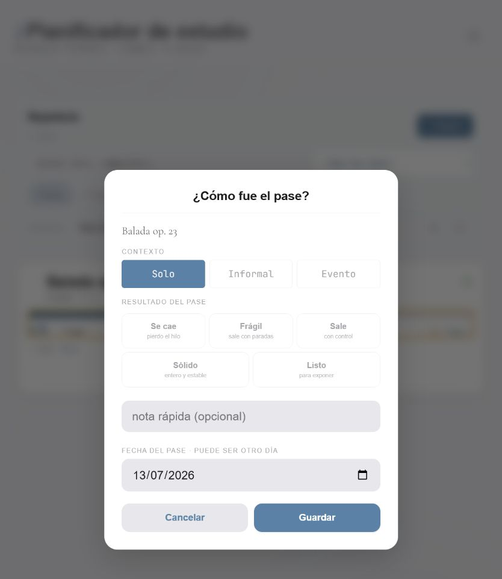

**Instruccion exacta**

1. Renombrar la accion de tarjeta a `Registrar pase` y mantenerla siempre visible.
2. Abrir un modal o popover con las cinco calidades como primer y principal contenido.
3. Usar `Solo` como contexto predeterminado si es el caso habitual.
4. Al tocar una calidad, guardar inmediatamente y mostrar `Deshacer` durante unos segundos.
5. Colocar contexto distinto, nota y fecha tras `Añadir detalles`.
6. Mostrar fecha solo cuando se activa `Otro dia`; el valor normal es hoy.
7. Evitar doble guardado con un ID estable e impedir que un doble toque cree dos pases.
8. Si se prefiere confirmacion explicita por fiabilidad, conservar Guardar pero mantener el resto de detalles colapsado y enfocar el boton despues de elegir calidad.

**Criterios de aceptacion**

- Un pase habitual se registra con dos acciones: abrir y elegir resultado.
- La confirmacion identifica obra, valor y fecha y permite deshacer.
- Los detalles avanzados siguen disponibles sin dominar el flujo.
- Doble toque, cierre rapido y recarga no duplican ni pierden el pase.

**Pruebas minimas**

- Cada una de las cinco calidades.
- Hoy, otra fecha, contexto distinto y nota.
- Doble toque, offline, deshacer y recarga inmediata.
- Lector de pantalla anuncia resultado y confirmacion.

---

### G-SOL-02. Rediseñar Evolucion con escala y muestras honestas

- **Estado:** PENDIENTE
- **Prioridad:** P1
- **Tamaño:** L
- **Tipo:** Visualizacion de datos

**Evidencia**

La tarjeta expresa solidez en porcentaje, pero la grafica usa eje 1-10. Dos mediciones el mismo dia quedan casi superpuestas, con puntos diminutos, gran espacio vacio y una leyenda `solo` que no explica la lectura. Con cero o una medicion se abre un modal practicamente vacio.

**Instruccion exacta**

1. Usar una unica escala 0-100 en tarjeta, detalle, historial y grafica.
2. Usar fecha y hora en el eje X para separar pases del mismo dia.
3. Con cero datos, no ofrecer la grafica; invitar a registrar el primer pase.
4. Con uno o dos datos, priorizar una lista cronologica compacta con valor, contexto y nota.
5. Dibujar tendencia solo con una muestra minima definida, recomendada en tres fechas o cinco pases.
6. Etiquetar puntos seleccionados y ofrecer tooltip/tap con valor exacto.
7. Añadir una tabla o lista accesible equivalente a la grafica.
8. Mantener alto suficiente en movil y eliminar espacio vacio que no codifica datos.

**Criterios de aceptacion**

- Tarjeta y grafica nunca muestran escalas distintas.
- Dos pases el mismo dia se distinguen.
- No se afirma una tendencia con datos insuficientes.
- Toda la informacion de la grafica es accesible sin depender del SVG.

**Pruebas minimas**

- Cero, uno, dos pases el mismo dia, cinco pases y un año de datos.
- Contextos solo, clase y escenario.
- Movil, iPad y modo oscuro.

---

### G-CAL-01. Integrar mes interactivo y agenda del dia

- **Estado:** PENDIENTE
- **Prioridad:** P2
- **Tamaño:** L
- **Tipo:** Calendario
- **Relacion:** Amplia `UI-04`.

**Evidencia**

`Eventos` y `Mes` son dos modos separados. El mes parece una cuadricula interactiva, pero sus dias no abren detalle ni permiten añadir. En iPad usa solo una franja superior y deja gran espacio vacio. La vista Eventos vacia tambien queda casi sin estructura.

**Instruccion exacta**

1. Mantener un encabezado `Calendario` con accion `Añadir evento` siempre visible.
2. Hacer cada dia un boton con estado de hoy, seleccionado y numero de eventos.
3. Mostrar debajo, o en panel lateral de iPad, la agenda del dia seleccionado.
4. Permitir añadir un evento con la fecha seleccionada ya rellenada.
5. En movil, usar mes compacto y agenda debajo; en iPad horizontal, mes y agenda en dos columnas.
6. Si no se va a implementar interaccion, eliminar la vista Mes en vez de conservar una cuadricula decorativa.
7. Mejorar contraste de dias de otro mes, hoy y eventos sin depender solo de color.

**Criterios de aceptacion**

- Tocar un dia produce una respuesta visible y accesible.
- El espacio de iPad se usa para agenda, no para un vacio ornamental.
- Añadir desde un dia conserva la fecha correcta.

**Pruebas minimas**

- Mes sin eventos, varios en un dia, cambio de mes y año bisiesto.
- Teclado, lector de pantalla y zona horaria.
- Movil e iPad horizontal.

---

### G-EST-01. Separar Estadisticas por dominios con alcance claro

- **Estado:** PENDIENTE
- **Prioridad:** P1
- **Tamaño:** L
- **Tipo:** Arquitectura de informacion

**Evidencia**

La pestaña mezcla racha, periodo, concentracion, comparacion, estudio intenso, mantenimiento, solidez, aprendizaje por compases, estado diario y lista de sesiones. El selector Semana/Mes/Año parece afectar todo, pero solo gobierna parte de las tarjetas. En movil la pagina supera 2700 px y en escritorio sigue siendo una columna.

**Instruccion exacta**

1. Crear segmentos de primer nivel `Tiempo`, `Solidez`, `Estado` e `Historial`; si Estado tiene poco uso, integrarlo en Hoy y dejar tres.
2. Colocar Semana/Mes/Año dentro de Tiempo y aplicar el periodo a todas las piezas de esa seccion.
3. Mover evolucion y pases a Solidez.
4. Mover la lista editable de sesiones a Historial sin mezclarla con graficas.
5. En iPad, usar dos columnas: KPI y grafica principal a ancho completo; tarjetas secundarias en paralelo.
6. Persistir la subvista elegida y mantener URL/estado accesible si la app lo permite.

**Criterios de aceptacion**

- Un control nunca aparenta modificar una tarjeta que no esta bajo su alcance.
- El primer viewport contiene una pregunta coherente, no seis dominios distintos.
- Historial sigue siendo editable y no queda escondido tras un scroll muy largo.

**Pruebas minimas**

- Cambiar periodo en cada subvista y verificar que solo se actualiza el dominio correcto.
- Datos vacios, una semana, un mes y un año.
- Rotacion de iPad y restauracion tras recarga.

---

### G-EST-02. Eliminar recomendaciones y ocultar paneles sin datos

- **Estado:** PENDIENTE
- **Prioridad:** P1
- **Tamaño:** M
- **Tipo:** Simplificacion de producto
- **Dependencias:** Coordinar con `ARC-01` y `STA-01`.

**Evidencia**

Con datos vacios se renderizan muchas tarjetas separadas con mensajes negativos. Con una obra aparecen `Que revisar ahora`, `Prioridad`, mantenimiento y estimaciones, aunque el propietario ha indicado que las sugerencias de estudio se eliminaran. Tambien permanece el bloque antiguo de aprendizaje/eficiencia por compases.

**Instruccion exacta**

1. Eliminar `Mantenimiento del repertorio`, `Que revisar ahora`, `Prioridad`, botones de estudiar y cualquier ranking prescriptivo.
2. Eliminar estadisticas antiguas de compases y eficiencia cubiertas por `STA-01`.
3. Mostrar un unico estado vacio de Estadisticas con `Iniciar cronometro` y `Registrar estudio`.
4. No renderizar una tarjeta solo para decir que aun no tiene datos.
5. Añadir cada seccion cuando alcance su muestra minima y explicar el periodo analizado.
6. Evitar mostrar la misma obra como prioridad, reciente y mantenimiento en tarjetas contiguas.

**Criterios de aceptacion**

- No queda ninguna recomendacion automatica sobre que o cuanto estudiar.
- Una instalacion vacia ve una pantalla breve y accionable.
- Las mediciones descriptivas de tiempo y solidez se conservan.

**Pruebas minimas**

- Busqueda final de textos y funciones de recomendacion.
- Cero datos, solo tiempo, solo solidez y ambos dominios.
- Importacion de datos antiguos con campos de compases.

---

### G-EST-03. Mejorar las graficas de tiempo y comparacion

- **Estado:** PENDIENTE
- **Prioridad:** P1
- **Tamaño:** L
- **Tipo:** Visualizacion de datos

**Evidencia**

Una semana con un solo bloque de 45 minutos muestra una barra naranja-azul en una grafica grande y, justo despues, otra tarjeta de tendencia que repite el mismo total. En movil el area medida es aproximadamente 280 x 86 px y los ejes son casi ilegibles. El gradiente no codifica ninguna variable.

**Instruccion exacta**

1. Usar un color solido de acento para tiempo; reservar colores distintos para categorias con significado.
2. Dar a la grafica una altura minima legible y etiquetas con unidad y periodo.
3. Mostrar valores al tocar o enfocar cada barra y una tabla accesible equivalente.
4. Sustituir la tarjeta de comparacion por una frase o KPI compacto cuando haya menos de tres periodos comparables.
5. Dibujar una tendencia solo con tres o mas periodos validos.
6. En semana, mantener siete posiciones estables pero reducir ornamentacion cuando solo hay un dato.
7. Usar una paleta semantica comun a claro y oscuro, sin gradientes decorativos.

**Criterios de aceptacion**

- Ejes, unidades y valores se leen en movil.
- No hay dos graficas consecutivas que expresen el mismo dato.
- Color y gradiente nunca sugieren una variable inexistente.

**Pruebas minimas**

- Cero, uno y siete dias con datos.
- Semana, mes y año con valores extremos.
- Tooltips por tacto, teclado y lector de pantalla.

---

### G-EST-04. Aplicar umbrales a graficas de distribucion y patrones

- **Estado:** PENDIENTE
- **Prioridad:** P1
- **Tamaño:** M
- **Tipo:** Integridad visual

**Evidencia**

Un unico bloque a las 10:00 produce una curva de `Momento del dia` y afirma `Pico a las 10:00`. Una sola obra produce un donut completo del 100 %. Ambas visualizaciones repiten el registro, pero aparentan haber descubierto un patron.

**Instruccion exacta**

1. Definir y documentar muestras minimas por grafica.
2. Para momento del dia, exigir varias sesiones repartidas en al menos tres dias; antes mostrar una lista simple de horas recientes.
3. Usar histograma por franjas horarias cuando exista muestra suficiente, no una linea continua que implica continuidad.
4. Mostrar reparto por obra como grafica solo si hay dos o mas obras con tiempo; con una, usar una fila de resumen.
5. No usar palabras `pico`, `tendencia`, `mejor` o `habitual` con una muestra insuficiente.
6. Mostrar tamaño de muestra y periodo junto a cualquier conclusion.

**Criterios de aceptacion**

- Una sesion aislada nunca se presenta como un habito.
- Una categoria unica no genera un donut sin informacion comparativa.
- Toda conclusion puede rastrearse a periodo y numero de observaciones.

**Pruebas minimas**

- Una sesion, tres sesiones el mismo dia, tres dias y treinta dias.
- Una, dos y siete obras.
- Datos sin hora real y datos importados.

---

### G-EST-05. Refrescar todas las vistas afectadas despues de guardar

- **Estado:** PENDIENTE
- **Prioridad:** P1
- **Tamaño:** S
- **Tipo:** Bug funcional visible

**Evidencia**

`confirmStudyRegister()` llama a `renderSesionesHistorial()`, `renderRacha()` y `refreshConcentradoUI()`, pero no a `renderStatsDashboard()` ni al resto de secciones de Estadisticas. En la prueba, despues de guardar 45 minutos la vista seguia mostrando 0 hasta cambiar de pestaña. Hoy llego a mostrar a la vez `0 min hoy`, `45 min esta semana` y `racha 1 dia`.

**Instruccion exacta**

1. Crear una funcion central de invalidacion/render posterior a cualquier mutacion de estudio.
2. Actualizar resumen de Hoy, racha, Estadisticas, Historial y tarjetas del cronometro desde la misma fuente de datos.
3. Llamarla desde registro manual, final de cronometro, edicion, borrado, importacion y sincronizacion remota.
4. Evitar render duplicado dentro del mismo frame mediante una cola o `requestAnimationFrame`.
5. Añadir prueba que guarde mientras Estadisticas esta activa y compruebe la cifra sin navegar.

**Criterios de aceptacion**

- Toda cifra visible cambia en el mismo flujo de guardado.
- Hoy, semana, racha e historial nunca se contradicen para la misma fuente.
- No hace falta recargar ni cambiar de pestaña.

**Pruebas minimas**

- Añadir, editar y borrar un bloque con Estadisticas activa.
- Finalizar cronometro y recibir cambio remoto.
- Comparar minutos en todas las vistas despues de cada accion.

---

### G-AJU-01. Simplificar Ajustes y aprovechar iPad horizontal

- **Estado:** PENDIENTE
- **Prioridad:** P1
- **Tamaño:** M
- **Tipo:** Preferencias
- **Relacion:** Amplia `UI-03`.

**Evidencia**

Ajustes es una de las vistas mas coherentes, pero repite `Sin sesion` en la fila de cuenta y en la seccion Cuenta. Identidad visual fija y selector de fuente se contradicen. En iPad horizontal sigue siendo una lista larga de una sola columna.

**Instruccion exacta**

1. Mantener el estilo actual de tarjetas y eliminar controles falsos mediante G-SYS-02 y G-SYS-04.
2. Unificar cuenta, sesion y sincronizacion en una sola seccion.
3. Agrupar sonido, volumen y haptica en un bloque compacto.
4. Usar dos columnas en iPad horizontal para Apariencia/Sonido y Cuenta/Datos, manteniendo orden logico de foco.
5. Mostrar estados tecnicos solo cuando requieren accion.
6. Corregir cadenas con codificacion rota mediante `TXT-01`.

**Criterios de aceptacion**

- Ningun estado de cuenta se repite.
- Cada control visible produce un cambio completo y perceptible.
- Las preferencias frecuentes caben en el primer viewport de iPad horizontal.

**Pruebas minimas**

- Cuenta conectada, desconectada, offline y error de sincronizacion.
- Claro, oscuro, sonido e haptica.
- Movil e iPad en ambas orientaciones.

---

### G-AJU-02. Mover importacion y exportacion avanzada a otra pantalla

- **Estado:** PENDIENTE
- **Prioridad:** P2
- **Tamaño:** M
- **Tipo:** Reduccion de ruido

**Evidencia**

La seccion Datos contiene exportacion para IA/Codex con varios modos y botones, importacion Forest y acciones de mantenimiento. Son herramientas valiosas pero tecnicas y poco frecuentes; al estar desplegadas convierten Ajustes en una pantalla operativa larga.

**Instruccion exacta**

1. Dejar en Ajustes una fila `Datos e importacion` con resumen de ultima copia o estado.
2. Abrir una pantalla o modal de herramientas avanzadas con secciones separadas: copia completa, contexto IA, importacion Forest y restauracion.
3. Explicar destino, alcance y privacidad justo antes de exportar o importar.
4. Mantener acciones destructivas separadas y con confirmacion explicita.
5. No mezclar sincronizacion de cuenta con importacion manual.

**Criterios de aceptacion**

- Ajustes principal contiene preferencias, no formularios tecnicos completos.
- Todas las capacidades actuales siguen accesibles.
- Importar o restaurar no puede confundirse con sincronizar.

**Pruebas minimas**

- Cada modo de exportacion y una importacion valida e invalida.
- Teclado, lector de pantalla y archivo grande.

---

### G-LIM-01. Retirar componentes visuales ocultos que siguen ejecutandose

- **Estado:** PENDIENTE
- **Prioridad:** P1
- **Tamaño:** L
- **Tipo:** Limpieza funcional
- **Dependencias:** `ARC-01`, `QUA-01` y capturas base de G-QA-01.

**Evidencia**

Hay componentes ocultos que siguen conectados o renderizandose: `sessionPlan`, `sessionInsightStack`, `ritmo-card-tiempo`, `session-concentrado-banner`, `crono-garden`, `crono-prob` y campos secundarios del cronometro. `renderSessionInsights()` calcula recomendaciones y escribe HTML en un host oculto; `renderCronoGarden()` genera un SVG que Marmol oculta. Esto añade trabajo, CSS y riesgo de interferencia.

**Instruccion exacta**

1. Inventariar todo elemento oculto con `display:none`, `hidden`, opacidad cero o reglas Marmol `!important`.
2. Clasificarlo como estado temporal necesario, accesibilidad, funcion futura aprobada o codigo muerto.
3. Eliminar HTML, render, listeners, estado y CSS de los componentes muertos como una unidad.
4. Retirar `renderSessionInsights()` y recomendaciones junto a `ARC-01`; no dejar calculos sin salida visible.
5. Retirar jardin y probabilidad si Marmol no los usa; si se decide conservarlos, volverlos una funcion visible aprobada y coherente.
6. No eliminar `sessionPlan` hasta desacoplar el guardado real indicado en `ARC-01`.
7. Medir tiempo de entrada a vistas antes y despues.

**Criterios de aceptacion**

- No se renderiza contenido que ningun usuario puede ver o usar.
- No queda CSS dedicado exclusivamente a nodos eliminados.
- Guardado, cronometro, importacion y datos antiguos siguen funcionando.

**Pruebas minimas**

- Busqueda de IDs y funciones retirados en HTML, CSS y JS.
- Smoke test de todas las vistas y flujos de estudio.
- Fixture antiguo con plan, probabilidad, jardin y preferencias de temas previos.

---

### G-QA-01. Añadir una matriz de regresion visual y usabilidad

- **Estado:** PENDIENTE
- **Prioridad:** P1
- **Tamaño:** L
- **Tipo:** Calidad
- **Dependencia:** Extiende `QUA-01`, ya implementado.

**Evidencia**

Ya existe una base de pruebas, pero esta auditoria encontro problemas que requieren estados visuales concretos: barra movil, pausa, datos vacios, una unica muestra, dos pases el mismo dia, texto grande y modo oscuro. Un smoke test de carga no detecta esas incoherencias.

**Instruccion exacta**

1. Crear fixtures deterministas `vacio`, `una-obra`, `solidez-dos-pases`, `semana-45-min` y `datos-abundantes`.
2. Congelar fecha, hora, zona horaria y animaciones en capturas.
3. Capturar vistas estables en 390 x 844, 834 x 1194, 1024 x 768 y 1280 x 720.
4. Probar Marmol claro y oscuro, tamaño Normal y grande, y movimiento reducido.
5. Añadir aserciones de `scrollWidth <= clientWidth`, hit areas, encabezados unicos y ausencia de contenido bajo la barra inferior.
6. Añadir pruebas de umbral para graficas: no renderizar tendencia, pico o donut cuando falta muestra.
7. Añadir un recorrido funcional de guardar y comprobar actualizacion inmediata de todas las cifras.
8. Revisar snapshots de forma intencionada; no actualizarlos automaticamente en CI.

**Criterios de aceptacion**

- Un cambio que reintroduce overflow movil, pausa ilegible o grafica engañosa falla antes de publicarse.
- Las capturas no dependen del reloj real ni de Supabase.
- CI conserva artefactos de diferencia visual cuando falla.

**Pruebas minimas**

- Matriz completa de vistas, estados y resoluciones descrita arriba.
- Navegacion por teclado y comprobacion automatica de contraste como apoyo, no sustituto de revision manual.
- Al menos una prueba real en Safari de iPad antes de cada lote visual grande.

## 9. Decisiones de producto que conviene tomar explicitamente

Estas preguntas no deben resolverse añadiendo mas controles. La recomendacion de la auditoria aparece en negrita:

| Elemento | Pregunta | Recomendacion |
|---|---|---|
| Pestaña Sesion | ¿Es una sesion de estudio o un registro del dia? | **Renombrar a Hoy y mantener el estado diario como secundario.** |
| Objetivo de 2 h | ¿Es una meta elegida por el usuario? | **Ocultarla hasta que se configure de forma explicita.** |
| Diario | ¿Es una funcion central? | **Conservarlo, pero debajo del inicio de estudio y con historial colapsable.** |
| Destellos | ¿Se consulta de verdad? | **Ocultarlo cuando es cero; moverlo al cierre o retirarlo si no hay uso.** |
| Tareas dentro del cronometro | ¿Ayudan durante la concentracion? | **Moverlas fuera del estado en marcha salvo que exista uso habitual.** |
| Jardin y `Plantar` | ¿Siguen siendo la identidad del producto? | **Retirarlos en favor de Marmol e `Iniciar`.** |
| Mes del calendario | ¿Debe permitir operar con fechas? | **Hacerlo interactivo o eliminarlo.** |
| Selector de fuente | ¿Son tres identidades completas? | **Eliminarlo y usar roles tipograficos estables.** |
| Recomendaciones de estudio | ¿Deben seguir existiendo? | **Eliminar, segun la decision ya tomada por el propietario.** |
| Graficas con una muestra | ¿Aportan comparacion? | **Sustituirlas por un resumen textual hasta alcanzar muestra suficiente.** |
| Titulo editable | ¿Aporta una tarea real? | **Eliminar de la cabecera; como maximo, mover a ajuste avanzado.** |

## 10. Orden recomendado de ejecucion

### Lote 1. Fallos visibles y confianza

`G-NAV-02`, `G-EST-05`, `G-CRO-03`, `G-HOY-02` y la parte correspondiente de `G-QA-01`.

**Por que primero:** corrige desbordamiento, datos que parecen falsos, un estado critico poco legible y valores no introducidos. Son cambios acotados y comprobables.

### Lote 2. Estructura comun

`G-SYS-02`, `G-SYS-03`, `G-SYS-04`, `G-SYS-05`, `G-NAV-01`, `G-NAV-03` y `G-FLU-01`.

**Por que despues:** establece tipografia, tamaños, cabeceras, breakpoints y movimiento antes de rediseñar cada pantalla.

### Lote 3. Flujo principal

`G-HOY-01`, `G-HOY-03`, `G-CRO-01`, `G-CRO-02`, `G-REP-01`, `G-REP-02`, `G-SOL-01` y `G-SOL-02`.

**Por que:** reduce la friccion diaria y hace Solidez facil de registrar sin sacrificar fiabilidad.

### Lote 4. Datos y vistas secundarias

`G-EST-01`, `G-EST-02`, `G-EST-03`, `G-EST-04`, `G-CAL-01`, `G-AJU-01`, `G-AJU-02` y `G-FLU-02`.

### Lote 5. Consolidacion

`ARC-01`, `G-LIM-01`, `G-SYS-01` y el resto de `G-QA-01`.

**Por que al final:** borrar capas y componentes ocultos es mucho mas seguro cuando la nueva estructura ya tiene pruebas y la retirada del organizador esta desacoplada de los datos reales.

## 11. Definicion de terminado para cualquier lote visual

Un lote no esta terminado solo porque una captura se vea mejor. Debe cumplir todo lo siguiente:

1. Mantiene las funciones y datos no incluidos en el cambio aprobado.
2. No añade scroll horizontal entre 320 y 1366 px.
3. Funciona con texto normal y grande sin usar `zoom` global una vez implementado G-SYS-03.
4. Tiene areas tactiles de al menos 44 x 44 px para acciones principales.
5. Tiene foco visible, nombres accesibles y orden de teclado coherente.
6. No deja contenido interactivo detras de un modal o pausa.
7. Claro y oscuro conservan la misma geometria y contraste suficiente.
8. Movimiento reducido elimina animaciones no esenciales.
9. Estados vacio, carga, error, un elemento y muchos elementos estan diseñados.
10. Graficas indican unidad, periodo y muestra y tienen alternativa textual.
11. Se han ejecutado pruebas unitarias, smoke, responsive y visuales relevantes.
12. Se ha comprobado en iPad real o Safari equivalente antes de publicar un cambio de layout grande.

## 12. Resultado esperado

La app no necesita una nueva capa decorativa. Necesita una jerarquia mas firme: una accion principal por pantalla, datos que solo aparezcan cuando significan algo, menos metaforas concurrentes y un sistema responsive que use el iPad como iPad. La direccion recomendada conserva el caracter sereno de Marmol y el buen cronometro en marcha, mientras elimina ruido, falsa precision y controles que hoy compiten con el estudio.
